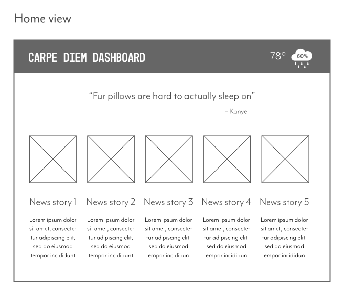
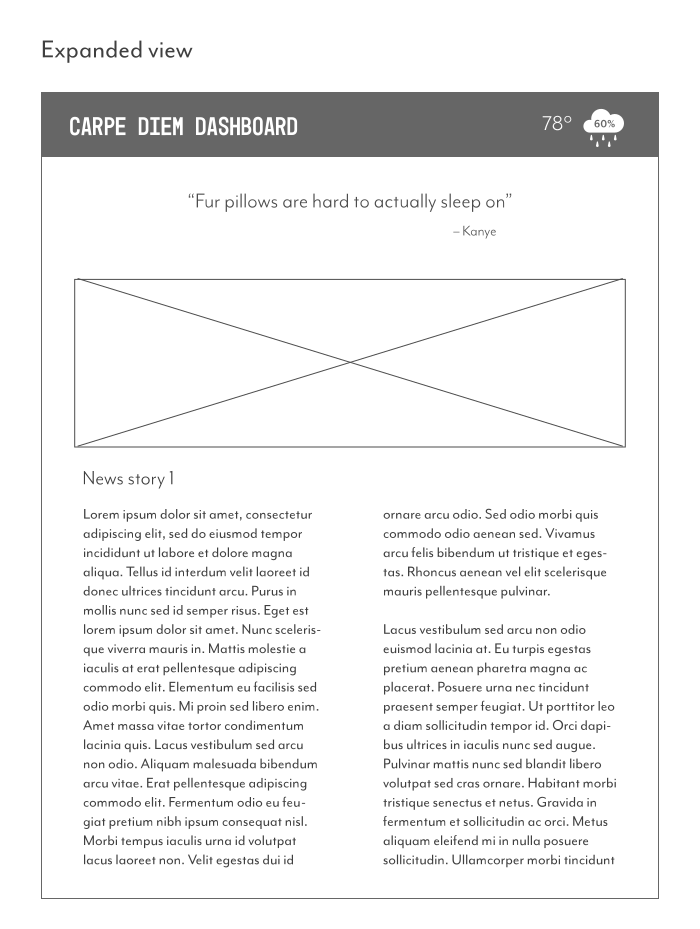
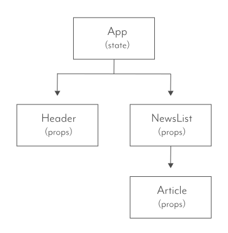

# Carpe Diem Dashboard

## Project Description

Carpe Diem is a dashboard designed to get users ready for the day. Relevant information helps users decide how to go about their day by showing them the top news, weather forecast, and an inspirational quote. Stage two (stretch goals) will incorporate their To-Do's and schedule for a more rounded

## Wireframes

## User Stories

### _MVP User Stories_

- _As a user, I want to see snippets of the top 5 news stories on New York Times so that I can be informed as to what is going on in the world today._

- _As a user, I want to be able to click on a story if it interests me so that I can read the full article._

---

### _Post MVP Silver Goals_

- _As a user, I want to see what the weather is going to be like today so that I can know what to expect, what to wear, and wether or not to bring an umbrella._

- _As a user, I want to see a random quote that will make me laugh or inspire me so that I can approach the day with lightness and a sense of play._

---

### _Post MVP Gold Goals_

- _As a user, I want to have a to-do list where I can see the tasks I need to accomplish today._

- _As a user, I want to have my schedule for the day to be aware of any meetings I might have._

---

 

## API

[NYT Top Stories API](https://developer.nytimes.com/docs/top-stories-product/1/overview)

#### NYT Top Stories response

    {
    	status: "OK",
    	copyright: "Copyright (c) 2020 The New York Times Company. All Rights Reserved.",
    	section: "home",
    	last_updated: "2020-07-29T01:16:29-04:00",
    	num_results: 55,
    	results: 
[
    	
{
    	section: "us",
    	subsection: "politics",
    	title: "Barr Clashes With House Democrats, Defending Responses to Protests and Russia Inquiry",
    	abstract: "The deployment of federal agents to confront protesters and rioters and attacks on the Russia investigation highlighted a contentious hearing.",
    	url: "https://www.nytimes.com/2020/07/28/us/politics/barr-testimony.html",
    	uri: "nyt://article/bd6071f6-800f-53f4-bb25-25c50999aa64",
    	byline: "By Nicholas Fandos and Charlie Savage",
    	item_type: "Article",
    	updated_date: "2020-07-29T01:15:46-04:00",
    	created_date: "2020-07-28T19:02:49-04:00",
    	published_date: "2020-07-28T19:02:49-04:00",
    	material_type_facet: "",
    	kicker: "",
    	des_facet: 
[
    	"Police Reform",
    	"George Floyd Protests (2020)",
    	"United States Politics and Government",
    	"Russian Interference in 2016 US Elections and Ties to Trump Associates",
    	"Special Prosecutors (Independent Counsel)"
    	],
    	org_facet: 
[
    	"House Committee on the Judiciary",
    	"Justice Department"
    	],
    	per_facet: 
[
    	"Barr, William P",
    	"Mueller, Robert S III",
    	"Jordan, Jim (1964- )",
    	"Nadler, Jerrold",
    	"Stone, Roger J Jr",
    	"Trump, Donald J"
    	],
    	geo_facet: [ ],
    	multimedia: 
[
    	
{
    	url: "https://static01.nyt.com/images/2020/07/28/us/politics/28dc-barr1/merlin_175037451_6440ff51-e1c6-45f2-9f62-481f1775936b-superJumbo.jpg",
    	format: "superJumbo",
    	height: 1365,
    	width: 2048,
    	type: "image",
    	subtype: "photo",
    	caption: "Attorney General William P. Barr testified before Congress on Tuesday for the first time in over a year.",
    	copyright: "Pool photo by Chip Somodevilla"
    	},
    	
{
    	url: "https://static01.nyt.com/images/2020/07/28/us/politics/28dc-barr1/28dc-barr1-thumbStandard.jpg",
    	format: "Standard Thumbnail",
    	height: 75,
    	width: 75,
    	type: "image",
    	subtype: "photo",
    	caption: "Attorney General William P. Barr testified before Congress on Tuesday for the first time in over a year.",
    	copyright: "Pool photo by Chip Somodevilla"
    	},
    	
{
    	url: "https://static01.nyt.com/images/2020/07/28/us/politics/28dc-barr1/28dc-barr1-thumbLarge.jpg",
    	format: "thumbLarge",
    	height: 150,
    	width: 150,
    	type: "image",
    	subtype: "photo",
    	caption: "Attorney General William P. Barr testified before Congress on Tuesday for the first time in over a year.",
    	copyright: "Pool photo by Chip Somodevilla"
    	},
    	
{
    	url: "https://static01.nyt.com/images/2020/07/28/us/politics/28dc-barr1/merlin_175037451_6440ff51-e1c6-45f2-9f62-481f1775936b-mediumThreeByTwo210.jpg",
    	format: "mediumThreeByTwo210",
    	height: 140,
    	width: 210,
    	type: "image",
    	subtype: "photo",
    	caption: "Attorney General William P. Barr testified before Congress on Tuesday for the first time in over a year.",
    	copyright: "Pool photo by Chip Somodevilla"
    	},
    	
{
    	url: "https://static01.nyt.com/images/2020/07/28/us/politics/28dc-barr1/merlin_175037451_6440ff51-e1c6-45f2-9f62-481f1775936b-articleInline.jpg",
    	format: "Normal",
    	height: 127,
    	width: 190,
    	type: "image",
    	subtype: "photo",
    	caption: "Attorney General William P. Barr testified before Congress on Tuesday for the first time in over a year.",
    	copyright: "Pool photo by Chip Somodevilla"
    	}
    	],
    	short_url: "https://nyti.ms/39AjmoQ"
    	}

 

[Kanye.rest API](https://kanye.rest/)

#### Kanye.rest response

    {"quote":"Sometimes I push the door close button on people running towards the elevator. I just need my own elevator sometimes. My sanctuary."}

 

## Component Hierarchy

#### Component details:

| **Component** | **Description**                                       | **State/Props** |
| ------------- | ----------------------------------------------------- | :-------------: |
| App           | This will handle React Router and call the components |      State      |
| Header        | This will render the header in the nav                |      Props      |
| NewsList      | This will render the top 5 articles                   |      Props      |
| Article       | This will render the individual article               |      Props      |
